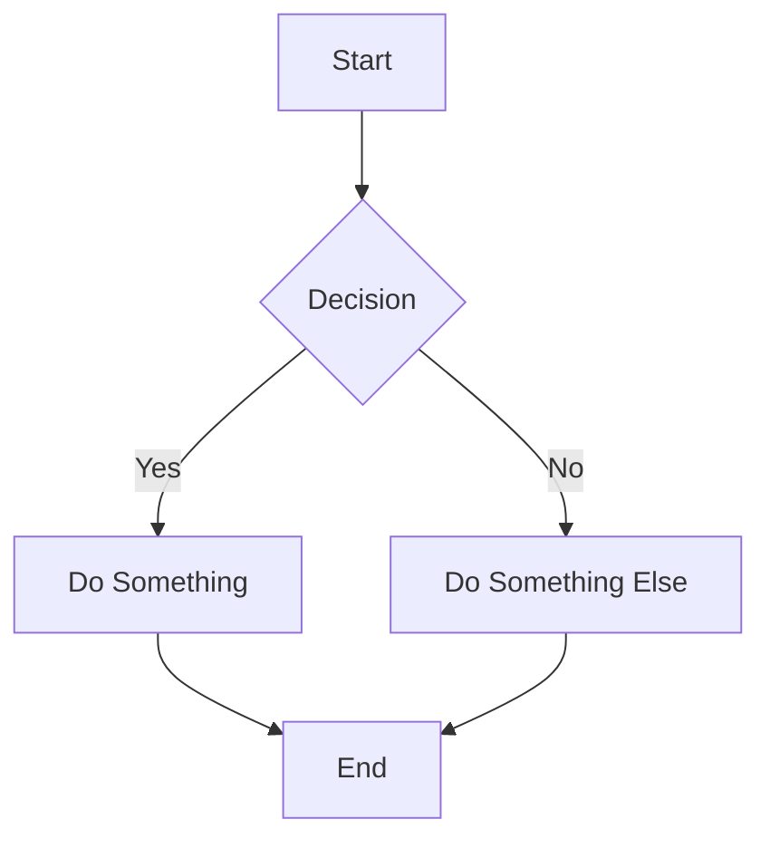
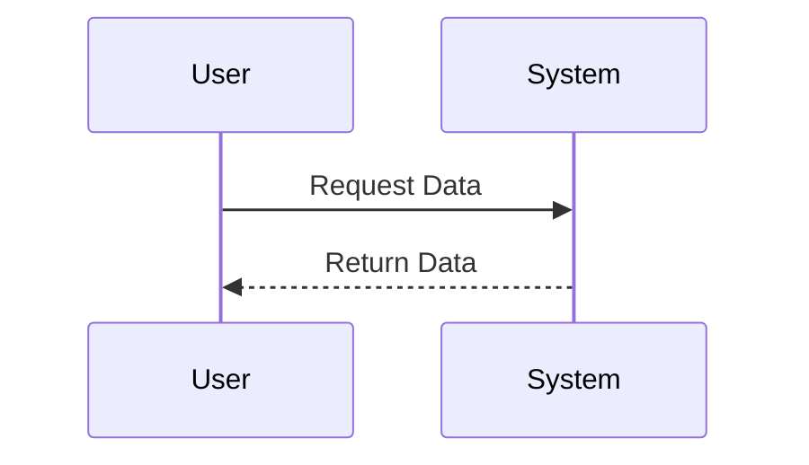
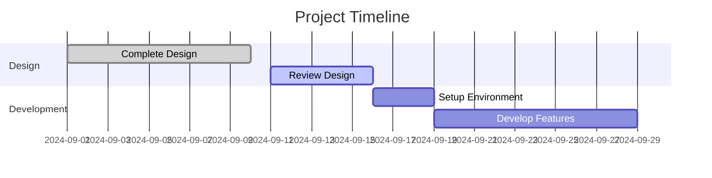
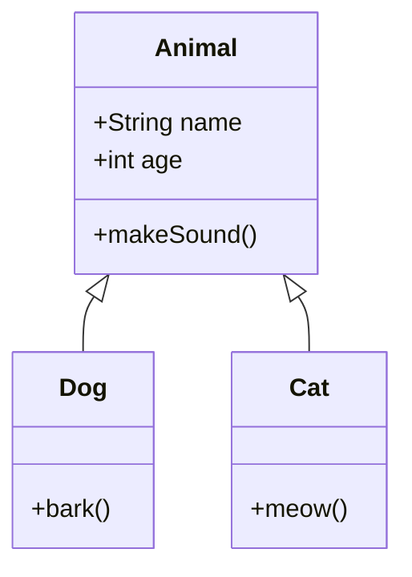
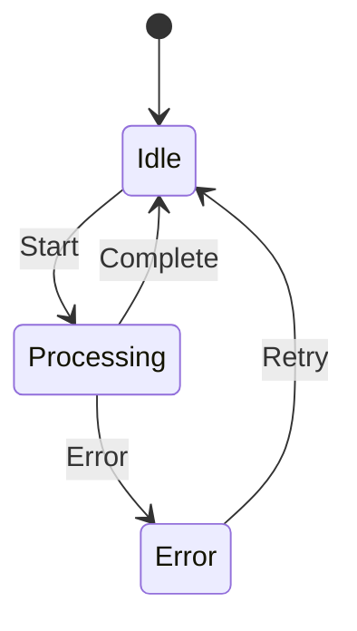
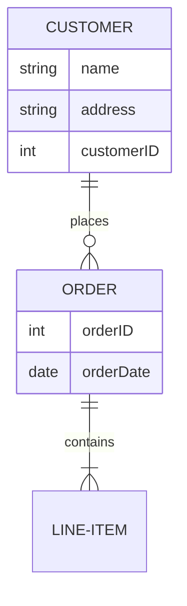

## A Comprehensive Guide to Using Mermaid for Diagramming

Mermaid is a powerful tool that allows you to create diagrams and visualizations using simple text-based instructions. It is especially useful for developers, technical writers, and project managers who want to integrate diagrams directly into their markdown, documentation, or websites without the need for complex graphic design tools.

### What is Mermaid?

Mermaid is a JavaScript-based diagramming tool that supports a variety of diagram types, including flowcharts, sequence diagrams, class diagrams, state diagrams, ER diagrams, Gantt charts, and more. It leverages a text-based syntax, making it easy to create, update, and version-control diagrams alongside your code or documentation.

### Key Features and Capabilities of Mermaid

Mermaid offers a wide range of capabilities, making it versatile for different diagramming needs:

#### 1. **Flowcharts**

Flowcharts are one of the most popular uses of Mermaid. They allow you to visualize processes, algorithms, or workflows. 

**Example:**

This simple syntax creates a flowchart that shows the flow of decision-making processes.

#### 2. **Sequence Diagrams**

Sequence diagrams are used to represent interactions between objects or components in a time sequence. They are particularly useful for describing protocols, user interactions, or system behaviors.

**Example:**

#### 3. **Gantt Charts**

Gantt charts in Mermaid help you visualize project timelines, tasks, and dependencies.

**Example:**

#### 4. **Class Diagrams**

Class diagrams help represent the structure of object-oriented systems by showing classes, their attributes, methods, and relationships.

**Example:**

#### 5. **State Diagrams**

State diagrams are useful for representing states and transitions in a system, such as user interfaces, protocols, or workflows.

**Example:**

#### 6. **Entity Relationship Diagrams (ERD)**

ER diagrams help model databases by representing entities, their attributes, and relationships between entities.

**Example:**

### Advanced Features

- **Theming:** Customize the look and feel of diagrams with themes.
- **Interactivity:** Add links, tooltips, and interactive elements to diagrams.
- **Security:** Mermaid can be configured to prevent script injection, making it safe for various use cases.

### Using Mermaid in Documentation and Websites

Mermaid can be easily integrated into various platforms, including Markdown files, GitHub README files, and web applications. It is supported in many popular documentation tools like Docusaurus, GitBook, and more.

For a quick and interactive way to create and test Mermaid diagrams, you can use the [Mermaid Live Editor](https://www.mermaidchart.com/landing/?utm_source=UGC&utm_medium=UGC&utm_campaign=0023). This editor provides an intuitive interface to write Mermaid syntax and see the resulting diagrams instantly.

### Get Started with Mermaid

To start using Mermaid in your projects, you can:

- Use it directly in your Markdown files by adding Mermaid's script to your project.
- Integrate it into your web application using JavaScript.
- Use plugins for popular static site generators and documentation tools.

For a hands-on guide and more examples, visit the [Mermaid Chart Guide](https://www.mermaidchart.com/).

### Conclusion

Mermaid is an excellent tool for creating a wide variety of diagrams with ease and efficiency. Its text-based approach allows for quick iterations and seamless integration into development workflows. Whether you're documenting software architecture, visualizing workflows, or mapping out database schemas, Mermaid has the capabilities to support your needs.

To generate images on the web, check out this [Mermaid Chart Tool](https://singular-catharanthus-5a60b5a247c5.herokuapp.com/b?y=49ii4eh26or66p1g70om4opl68pj4dhg65h36p366kr68cp25gh748hq49k78t3gect2ubrnetrisrb5e9mm2qb4cdk62sjk5phmur9fdhgmsp39dpjiufrlehmlusrfelp66p9tal3k6n3l60o34djlehmlurb5chknar9tal3k6n3l60o34djlehmluor1dlo62qb7douj0c1i6ch0====). Please note that this is an affiliate link, and using it supports us at no additional cost to you.
