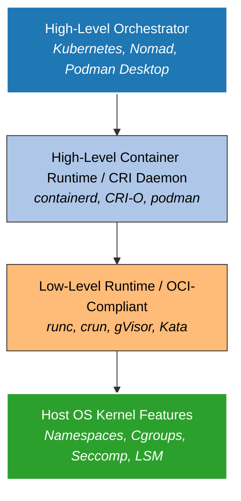
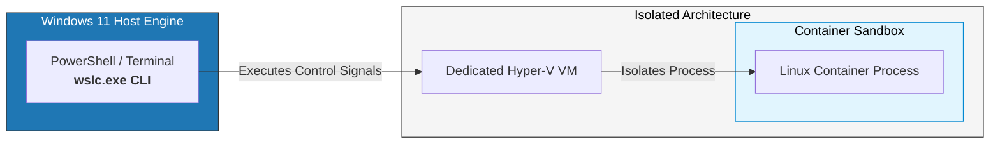
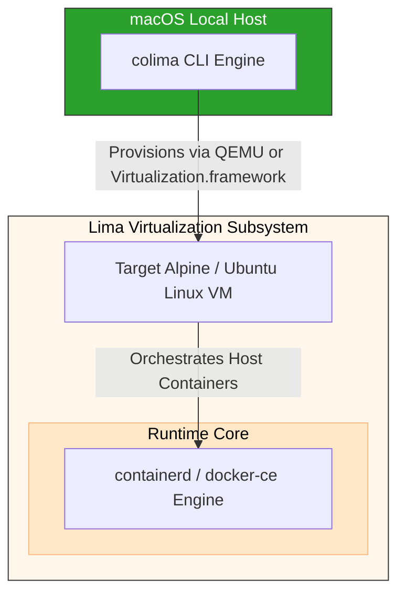
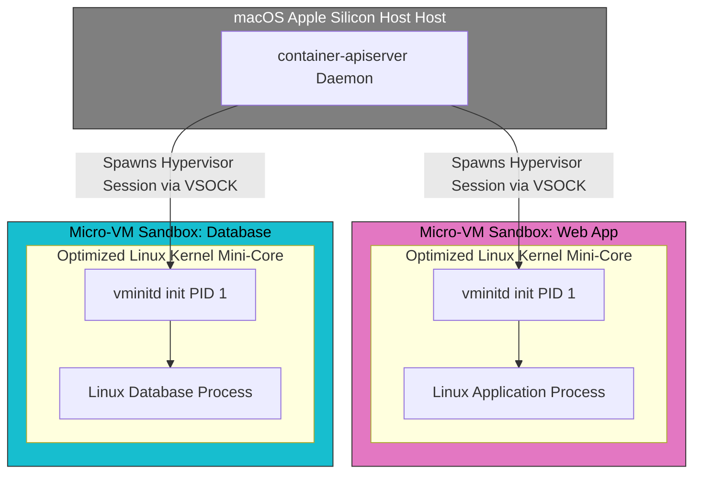

# Beyond the Whale: The Architecture, Trade-Offs, and Implementation of Post-Docker Container Frameworks

For nearly a decade, the word "Docker" has been used interchangeably with "container." However, shifting enterprise licensing models, architectural bottlenecks, and security considerations have forced a fundamental re-evaluation of the container stack.

Modern containerization is governed by open standards, specifically the Open Container Initiative (OCI). This decoupling of the container ecosystem allows engineers to swap the monolithic daemon (`dockerd`) for highly optimized, modular alternatives.

---

## 1. The Core Architecture of Modern Container Runtimes

To understand why alternatives to Docker exist, we must break down what Docker actually is. Docker is a monolithic platform that orchestrates multiple tasks: image building, registry interaction, container management, volume handling, and networking. Under the OCI specification, this monolith is broken down into modular components.



### High-Level Runtimes vs. Low-Level Runtimes

* **Low-Level Runtimes (OCI Runtimes):** These are responsible for the actual creation of the sandbox environment. They configure host Linux cgroups and namespaces, and execute the container process. The de facto standard is **`runc`** (written in Go), though alternatives like **`crun`** (written in C) offer significantly faster execution times and lower memory footprints.
* **High-Level Runtimes (Container Daemons):** These manage the lifecycle of images, abstract network configurations, pull layers from registries, and hand off decrypted OCI bundles to the low-level runtime. **`containerd`** and **`CRI-O`** fall into this category.

### The OCI Standard: Images and Runtimes

The Open Container Initiative guarantees interoperability across two specifications:

1. **Image Specification:** Defines the layout of an archive consisting of layer tarballs and a configuration JSON containing environment variables, entry points, and architectures.
2. **Runtime Specification:** Dictates how that unpacked image structure is mapped to host OS features to spin up a process.

Any modern alternative tool can pull an image built with Docker and run it natively, as long as it adheres to these specifications.

---

## 2. Comprehensive Comparison of Major Docker Alternatives

| Metric / Feature | Podman | containerd + nerdctl | Rancher Desktop | OrbStack (macOS) |
| --- | --- | --- | --- | --- |
| **Architecture** | Daemonless, Rootless | Daemon-based, Root | Daemon-backed VM | Lightweight Native VM |
| **Primary OS** | Linux (Native), Mac/Win (VM) | Linux (Native), Mac (via Lima) | Windows, macOS, Linux | macOS Only |
| **K8s Integration** | Play/Generate Kube YAML | Via `k3s` / `kind` | Built-in `k3s` | Built-in |
| **License** | Apache 2.0 (Open Source) | Apache 2.0 (Open Source) | Apache 2.0 (Open Source) | Proprietary (Free for Personal) |
| **Resource Usage** | Very Low | Low | Moderate to High | Extremely Low |
| **Drop-in CLI Compatibility** | Excellent (`alias docker=podman`) | High (`nerdctl`) | Standard Docker CLI | Identical Docker CLI |

---

## 3. Deep Dive into Alternatives

### Podman (Pod Manager)

Podman, engineered primarily by Red Hat, is the most direct substitute for Docker.

* **Daemonless Architecture:** Docker relies on a centralized daemon (`dockerd`) running with root privileges. If the daemon crashes, all managed containers go down. Podman eliminates this single point of failure; it executes containers as standard fork/exec child processes of the calling user or service manager (`systemd`).
* **Rootless Execution:** Podman leverages user namespaces (`user_namespaces(7)`) to map arbitrary host User IDs (UIDs) to root/non-root UIDs inside the container. This limits potential container breakout vulnerabilities, as the process executing inside the container has no privileges on the host system.

### Containerd & Nerdctl

* **`containerd`:** Originally stripped out of Docker itself, `containerd` is a CNCF-graduated high-level container runtime. It is the underlying muscle for production Kubernetes clusters worldwide.
* **`nerdctl`:** Because `containerd` is intended as a programmatic backend, its native CLI tool (`ctr`) is intentionally unpolished. To bridge the developer experience gap, the community built `nerdctl` (Nerd Control). It provides a drop-in UX for `containerd` that supports cutting-edge features like lazy-pulling (e.g., eStargz) and encrypted OCI images.

### Rancher Desktop

Managed by SUSE, Rancher Desktop packages open-source container utilities into a cohesive desktop GUI app. It lets you select your high-level container runtime backend (`containerd` or standard Moby/Docker engine) and comes tightly coupled with a local Kubernetes cluster powered by **`k3s`**.

---

## 4. Native Windows Containers via WSL 2 Without Docker Desktop

Historically, running Linux or native Windows containers on Windows meant installing Docker Desktop, which enforces complex commercial licensing and consumes notable background resources. Microsoft provides fully native alternatives.

### Option A: The Legacy/Manual Approach (Manual Engine Installation in WSL 2)

You can set up a completely decoupled open-source Docker engine directly inside an independent WSL 2 Linux distribution.

#### Step 1: Purge Docker Desktop and Unregister Environments

Run these commands from an elevated administrative PowerShell prompt:

```powershell
# Uninstall the application manually from Settings or App & Features, then:
wsl --unregister docker-desktop
wsl --unregister docker-desktop-data

```

#### Step 2: Set Up Docker-CE inside Ubuntu WSL 2

Boot into your raw WSL 2 distro (e.g., Ubuntu) and run the following configuration commands:

```bash
# Update local packages
sudo apt-get update && sudo apt-get install -y ca-certificates curl gnupg lsb-release

# Add Docker's official GPG key
sudo mkdir -p /etc/apt/keyrings
curl -fsSL https://download.docker.com/linux/ubuntu/gpg | sudo gpg --dearmor -o /etc/apt/keyrings/docker.gpg

# Set up the repository structure
echo "deb [arch=$(dpkg --print-architecture) signed-by=/etc/apt/keyrings/docker.gpg] https://download.docker.com/linux/ubuntu $(lsb_release -cs) stable" | sudo tee /etc/apt/sources.list.d/docker.list > /dev/null

# Install the engine binaries natively
sudo apt-get update
sudo apt-get install -y docker-ce docker-ce-cli containerd.io docker-buildx-plugin docker-compose-plugin

```

#### Step 3: Configure Init / Systemd Compatibility

Modern WSL 2 natively supports `systemd`. Ensure it is active by modifying your `/etc/wsl.conf` within the Linux instance:

```ini
[boot]
systemd=true

```

Restart your WSL instance from PowerShell (`wsl --shutdown`), re-enter, and execute:

```bash
sudo systemctl enable --now docker
sudo usermod -aG docker $USER

```

---

### Option B: The Modern Approach (Native WSL Containers via `wslc.exe`)

Microsoft native integration offers native Linux container capabilities through **WSL Containers** (`wslc.exe`). This model executes containerized workloads inside dedicated, lightweight Hyper-V VMs directly managed by the host subsystem without requiring a third-party management layer.



#### Prerequisite Validation

Ensure your WSL architecture is up to date via PowerShell:

```powershell
wsl --update
wslc version

```

#### Managing WSL Containers Natively

To pull an OCI image and initialize a sandbox directly from standard host command lines without an active Docker daemon daemon:

```powershell
# Run a transient interactive bash environment
wslc run --rm -it ubuntu:latest bash

# Launch a background web server mapping host ports
wslc run -d --rm -p 8080:80 --name local-web nginx:alpine

# Query running instances
wslc container list

```

---

## 5. Apple Silicon Architecture: High-Performance Containers Without Docker Desktop

On Apple Silicon (M1/M2/M3/M4) Macs, traditional container runtimes suffer from two main performance issues: Rosetta 2 emulation layer bottlenecks for x86_64 target images, and massive file synchronization overhead over virtualized block stores.

### Option A: OrbStack (The Ultra-Lightweight Commercial Challenger)

OrbStack is a proprietary, hyper-optimized drop-in alternative for macOS written in native Swift. It interacts directly with the Apple **Virtualization.framework** kernel APIs.

* **Dynamic Allocation:** Unlike Docker Desktop, which reserves a fixed segment of RAM (e.g., 8GB locked uniformly), OrbStack treats memory elastically. It dynamically requests memory from macOS and returns it immediately when processes idle.
* **VirtioFS Architecture:** It replaces heavy gRPC-fuse syncing engines with low-level VirtioFS bindings, delivering near-native disk read/write access speeds when performing hot-reloading operations in bind mounts.

#### Setup and Operation via Homebrew

```bash
# Install via brew
brew install orbstack

# The background orchestration engine initializes in less than a second. 
# It provides immediate drop-in docker binary context paths.
docker ps
docker compose up -d

```

---

### Option B: Colima + Lima (The Fully Open-Source Stack)

For teams seeking a completely open-source toolchain on macOS, the preferred configuration pairs **Lima** (Linux Machines on Mac) with **Colima** (Container Run-times on Lima).



Colima provisions an thin, headless Linux VM inside macOS using QEMU or Apple Virtualization.framework, then configures `containerd` or `docker-ce` runtimes inside that VM.

#### Pure CLI Implementation Walkthrough

```bash
# Install the core CLI toolchains
brew install colima docker docker-compose

# Initialize Colima leveraging native macOS virtualization and Rosetta 2 emulation
colima start --runtime docker --vm-type=vz --vz-rosetta --cpu 4 --memory 8

# Verify socket health status
colima status

```

By utilizing `--vm-type=vz --vz-rosetta`, any compiled x86_64 image layout pulled down from remote registries will run via hardware-accelerated Apple Silicon translation, bypassing slow QEMU instruction translation.

---

## 6. Deep Dive: Apple’s Native Container Engine (`apple/container`)

Apple fundamentally changed the container landscape on macOS by open-sourcing **`apple/container`** (built upon the foundational `apple/containerization` Swift package). Unlike every other tool mentioned—which rely on one massive, always-on, shared Linux Virtual Machine running a shared kernel for all your containers—Apple’s native tool introduces an isolated **per-container micro-VM architecture**.



### The Architectural Shift: Per-Container Micro-VMs

When you execute a container using `apple/container`, the runtime spins up a dedicated, hyper-isolated lightweight instance of an optimized Linux kernel specifically for that process.

* **The Control Plane (`container-apiserver`):** Managed as a macOS native launch agent, the API server handles container requests and interacts with specialized XPC helpers (like `container-core-images` for OCI layer caching and `container-network-vmnet` for local virtual routing).
* **The Guest Init System (`vminitd`):** Inside each micro-VM, Apple drops a custom, ultra-minimal init binary called `vminitd`. It is spawned as PID 1, communicates directly with the host macOS control plane using gRPC over hypervisor sockets (`vsock`), maps signals, forwards bidirectional standard I/O streams, and boots the target container process in milliseconds.
* **Elastic Memory Reclamation:** Because isolation happens at the hypervisor layer rather than a shared kernel namespace layer, when an individual container stops or goes idle, its entire hardware memory segment is fully reclaimed and released back to macOS immediately.

---

### Deep Optimization for Apple Silicon Hardware

The `apple/container` ecosystem is explicitly built to exploit the microarchitectural advantages of Apple Silicon (M-series SOCs). It completely drops legacy Intel x86 support to avoid abstraction overhead.

#### 1. Hardware-Accelerated Virtualization via `Virtualization.framework`

Instead of using complex hypervisor layers like QEMU, the Swift toolchain talks natively to macOS kernel APIs. It utilizes hardware virtualization extensions built directly into the M-series performance cores (P-cores) to execute guest OS instructions directly at bare-metal speed with near-zero instruction translation latency.

#### 2. Native Rosetta 2 Translation for Cross-Architecture Pipelines

Running x86_64 (`amd64`) Linux containers on ARM64 developer machines is traditionally a performance nightmare due to software emulation. Apple's framework pipes x86 instructions through a special hardware-backed Rosetta translation hook inside the Linux kernel configuration.

* This maps complex instruction sets into ARM64 instructions at runtime using the chip's internal, hardware-level page table toggles (such as alternate memory ordering modes native to Apple Silicon).

#### 3. Hyper-Optimized Storage via Memory-Mapped Blocks

File synchronization over standard Docker volumes is typically slowed down by translation bridges. Apple bypasses this entirely. The `apple/containerization` package formats native block devices from the Mac's unified memory structure and attaches them straight to the guest via lightning-fast `VIRTIO` storage drivers.

---

### Implementation Walkthrough: Going Dockerless with `apple/container`

#### Step 1: Toolchain Installation

Because it relies tightly on system APIs added in modern macOS releases, ensure you are running Xcode command-line tools and install the package binaries:

```bash
# Verify Apple Silicon native environment
uname -m # Should output: arm64

# Install using homebrew or pull the signed pkg from apple/container GitHub releases
brew install apple-container

```

#### Step 2: System Initialization

To bring up the local native control plane, initialize the daemon-free API server architectures:

```bash
# Start the system launch agents and virtual network interfaces
container system start

```

This automatically initializes the structured TOML configuration layout located globally at `~/.config/container/config.toml`.

#### Step 3: Running OCI Workloads Natively

The syntax natively accepts OCI-compliant formats. You can pull directly from Docker Hub or GitHub Container Registry (GHCR) without needing any Docker translation layers:

```bash
# Run a transient interactive Bash environment
container run --rm -it ubuntu:latest bash

# Launch an Nginx background instance with explicit hardware limitations
container run -d --name native-web --cpus 2 --memory 2g -p 8080:80 nginx:alpine

```

#### Step 4: Provisioning Long-Lived "Container Machines"

A standout feature of the tool is **Container Machines** (similar to WSL for Mac). This lets you turn any standard OCI container image containing an init system (`/sbin/init`) into a persistent, deeply integrated local Linux workspace.

```bash
# Spin up a persistent Ubuntu development node
container machine create MyLinuxWorkspace ubuntu:latest

# Enter the environment
container machine shell MyLinuxWorkspace

```

Inside this machine shell, your macOS host home directory is automatically mounted, file changes persist between reboots, and the shell context natively assumes your exact Mac user identity and permissions.

## 6. Migration Guide & Potential Pitfalls

When moving away from Docker Desktop, keep these technical details in mind to prevent broken pipelines:

### 1. Hardcoded Unix Socket Locations

Many tools, test frameworks (like Testcontainers), and CI scripts expect the system daemon socket to live at `/var/run/docker.sock`. When migrating to Podman or rootless setups, this path shifts.

* *The Fix:* Export environmental overrides pointing to the alternate socket path:
```bash
export DOCKER_HOST="unix://$HOME/.local/share/containers/storage/run/podman/podman.sock"

```


### 2. Configuration Objects (`.docker/config.json`)

Credential helpers for cloud registries (AWS ECR, Google Artifact Registry) often write auth tokens into `~/.docker/config.json`. Alternate tools like Podman query `~/.config/containers/auth.json` instead. You can bridge this gap by creating symbolic links or explicitly passing configuration arguments during compilation runs.

---

## Summary Recommendation: Which Tool to Choose?

* If your deployment environment is tightly coupled with **Red Hat, OpenShift, or corporate security compliance policies requiring rootless execution**, migrate fully to **Podman**.
* If you are developing exclusively on **macOS and need maximum raw filesystem execution speed**, choose **OrbStack**.
* If you need a **100% open-source, highly granular development environment on Mac**, configure **Colima**.
* If you are operating on a **modern Windows platform**, run Docker directly within a **systemd-enabled WSL 2 Linux distribution** or use **native WSL Containers (`wslc.exe`)**.
